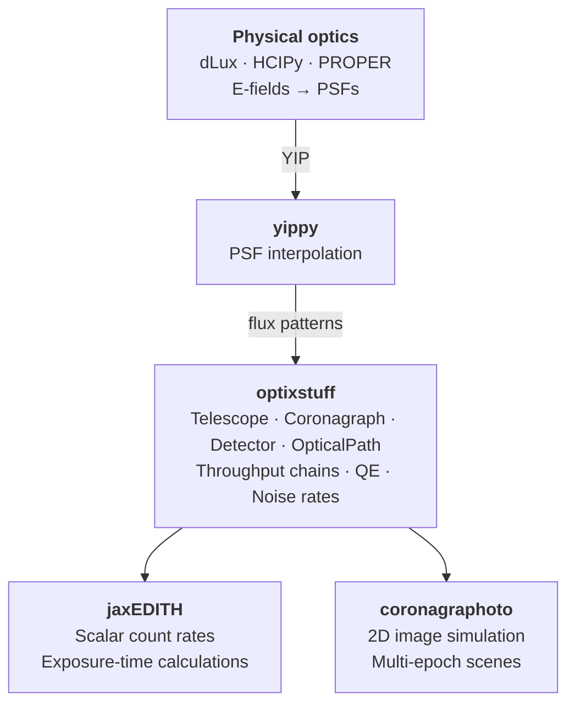

# optixstuff

Shared hardware objects — with standard values — for the HWO direct-imaging
simulation suite.

## What optixstuff is

`optixstuff` is a **thin shared dependency** that defines the observatory's
hardware as composable JAX modules: primary aperture, throughput-affecting
elements, coronagraph backend, detector. Its job is to be the single source of
truth for the hardware configuration that downstream tools consume.

Both [coronagraphoto](https://github.com/CoreySpohn/coronagraphoto)
(2D image simulation) and [jaxEDITH](https://github.com/CoreySpohn/jaxedith)
(exposure-time and yield calculations) import the same `OpticalPath` class and
the same detector / throughput / primary types from optixstuff. Change a value
here and both downstream tools pick it up on the next import.

## What optixstuff is *not*

- **Not a wavefront tool.** Diffraction, E-field propagation, and PSFs-from-first-principles
  belong to [dLux](https://github.com/LouisDesdoigts/dLux) and [HCIPy](https://github.com/ehpor/hcipy).
- **Not a PSF interpolator.** That's [yippy](https://github.com/CoreySpohn/yippy)'s job;
  optixstuff wraps a PSF backend via `YippyCoronagraph` but does not compute PSFs.
- **Not a scene model.** Stars, planets, disks, and zodi live in
  [skyscapes](https://github.com/CoreySpohn/skyscapes).
- **Not a simulator.** Downstream tools (coronagraphoto, jaxEDITH) consume an
  `OpticalPath` to produce images or count rates.

## Architecture

Built on [JAX](https://github.com/google/jax) and
[Equinox](https://github.com/patrick-kidger/equinox), `optixstuff` provides:

- **Abstract interfaces** — `AbstractPrimary`, `AbstractOpticalElement`,
  `AbstractCoronagraph`, `AbstractDetector`
- **Concrete implementations** — `SimplePrimary`, `ConstantThroughput`,
  `IdealDetector`
- **Container** — `OpticalPath`, a composable hardware configuration passed to all
  simulators

Every abstract method accepts three fidelity axes — **wavelength**, **position**, and
**time** — with defaults so that simple implementations can ignore unused axes while
future high-fidelity models (wavelength-dependent coatings, position-dependent vignetting,
time-dependent detector degradation) can use them without breaking the interface.

### Ecosystem position



## Installation

```bash
pip install optixstuff
```

## Status

This package is in early development (pre-v0.1.0).
