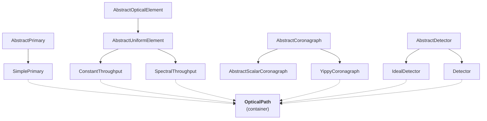

# Architecture

optixstuff is the thin shared hardware dependency for the HWO
simulation suite. This page covers the hardware objects it
provides and the three-axis design (wavelength / position / time).

## The role of optixstuff

`optixstuff` provides **composable hardware objects** -- primary,
throughput elements, coronagraph backend, detector -- and a container
(`OpticalPath`) that bundles them. The hardware objects hold attributes
like quantum efficiency curves, throughput, dark-current
rates, and pixel scales; downstream tools query those attributes to
do their own work.

It (generally) does **not** simulate. There is no "simulate this observation"
entry point in optixstuff. Instead:

1. **Scalar ETC calculations** (jaxEDITH) ask "given this hardware and
   this target, what's the per-aperture count rate?" The hardware
   attributes are inputs.
2. **2D image simulation** (coronagraphoto) asks "given this hardware
   and this scene, what does the detector see?" The same hardware
   attributes are inputs.

Both tools need the same hardware definition. optixstuff is the shared
source of truth: change the detector's QE here and both your ETC
numbers and your simulated images update together on the next import.

## The abstractions



Five families of abstract base + concrete implementations, composed
into a single `OpticalPath`:

| Family | Abstract base | Concrete examples |
|---|---|---|
| Primary aperture | `AbstractPrimary` | `SimplePrimary` |
| Throughput-affecting element | `AbstractOpticalElement` | `ConstantThroughput`, `SpectralThroughput` |
| Coronagraph backend | `AbstractCoronagraph` | `YippyCoronagraph` |
| Detector | `AbstractDetector` | `IdealDetector`, `Detector` |
| Composition container | (none) | `OpticalPath` |

## What throughput elements stand in for

`ConstantThroughput` and `SpectralThroughput` are abstract enough to
represent any wavelength-dependent loss in the optical path. Mapping
to real hardware:

| Concrete element | Represents |
|---|---|
| `ConstantThroughput` | Flat-reflectivity mirror coating, broadband neutral-density filter, fold mirror with achromatic reflectivity |
| `SpectralThroughput` | Any tabulated wavelength-dependent throughput -- mirror reflectivity curves, bandpass filters, dichroics, other filters |

A real instrument has many individual physical components -- primary
mirror, secondary, deformable mirror, fold mirrors, polarisers,
bandpass filters, dichroics, lenses -- each with its own throughput
curve. In optixstuff they all enter the radiometric model the same
way: "a wavelength-dependent fraction that scales the incoming flux."
The `OpticalPath` holds a `tuple[AbstractOpticalElement, ...]` whose
effective throughput is the product of every element's
`get_throughput(wavelength_nm)`:

```python
path = OpticalPath(
    primary=SimplePrimary(diameter_m=6.0),
    attenuating_elements=(
        ConstantThroughput(throughput=0.95),               # primary coating
        ConstantThroughput(throughput=0.95),               # secondary mirror
        ConstantThroughput(throughput=0.97),               # fold mirror
        SpectralThroughput(wavelengths_nm, mirror_R),      # measured mirror reflectivity
        SpectralThroughput(wavelengths_nm, filter_T),      # bandpass filter
    ),
    coronagraph=...,
    detector=...,
)

print(path.system_throughput(550.0))  # product across all elements
```

The abstraction lets you swap real-instrument throughput curves in
and out without changing how downstream tools consume the result.
Higher-fidelity elements (e.g. one with a position-varying vignetting
profile) can subclass `AbstractOpticalElement` directly to use the
position axis -- see the next section.

## The three-axis design

Every abstract method accepts three optional axes of variation:

- **Wavelength** -- spectral dependence
- **Position** -- spatial / field-angle dependence
- **Time** -- temporal evolution (degradation, drift)

Simple implementations ignore axes they don't model (e.g.,
`IdealDetector.get_qe(wavelength)` returns a constant regardless of
the wavelength input). High-fidelity implementations can use them
without breaking the API:

```python
class WavelengthDependentQE(AbstractDetector):
    def get_qe(self, wavelength_nm):
        return self._qe_interp(wavelength_nm)   # real wavelength dep

class TimeVaryingDetector(AbstractDetector):
    def dark_current_rate_at(self, time_jd):
        # detector degrades over mission lifetime
        return self._rate0 * (1 + self._deg_per_yr * (time_jd - self._t0))
```

This is the **fidelity axis** in optixstuff's design: start simple,
add complexity without rewriting consumers. coronagraphoto's
`star_rate`, `system_rate`, etc. accept any subclass of any abstract
base. Swap an `IdealDetector` for a `WavelengthDependentQE` and the
image simulation picks up the new physics with zero downstream
changes.

## OpticalPath as a composable container

`OpticalPath` is an `eqx.Module` (PyTree-registered) that holds the
hardware configuration:

```python
class OpticalPath(eqx.Module):
    primary: AbstractPrimary
    attenuating_elements: tuple[AbstractOpticalElement, ...]
    coronagraph: AbstractCoronagraph
    detector: AbstractDetector
```

Two convenience methods compose elements:

- `system_throughput(wavelength_nm)` -- product of all element
  throughputs at a wavelength
- `detector.get_qe(wavelength_nm)` -- detector QE at that wavelength

That's it. The container does not own simulation logic; it just holds
hardware. Simulators (coronagraphoto, jaxEDITH) consume the container,
query its throughput / QE / coronagraph response, and produce
science-level outputs.

## Detector noise: hardware physics, not scene simulation

optixstuff exposes three noise primitives at the module level:

```python
dark_current(rate, exposure_time_s, shape, prng_key) -> Array
clock_induced_charge(rate, num_frames, shape, prng_key) -> Array
read_noise(noise_e, num_frames, shape, prng_key) -> Array
```

These are **noise contributions**, not full detector readouts. They
take only detector-side parameters (rates, frame time, shape) and
return additive noise arrays meant to be summed onto a scene-source
readout. Splitting the responsibilities:

- coronagraphoto's `*_readout` family = Poisson-realised source counts
  (depends on a `Scene`)
- optixstuff's noise primitives = additive hardware noise contributions
  (independent of any `Scene`)

Both compose into a complete frame:

```python
source_e = star_readout(star, optical_path, key1, ...)
dark_e   = dark_current(detector.dark_current_rate_e_per_s,
                                  exposure_time_s, detector.shape, key2)
cic_e    = clock_induced_charge(detector.clock_induced_charge_rate_e_per_frame, num_frames,
                         detector.shape, key3)
read_e   = read_noise(detector.read_noise_e,
                                num_frames, detector.shape, key4)
frame    = source_e + dark_e + cic_e + read_e
```

For most use cases you can let the detector's high-level `readout`
method handle the composition for you. The standalone primitives are
exposed for advanced use (custom noise budgets, sensitivity studies).

See [detector models](detector_models) for the full noise-budget
discussion.

## Where to read next

- [Detector models](detector_models) -- IdealDetector, Detector, and
  the noise primitives
