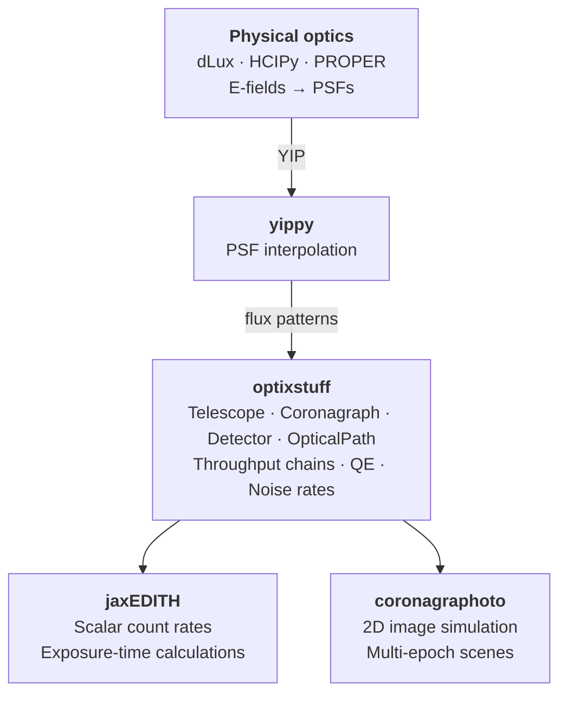

# optixstuff

Shared hardware objects -- with standard values -- for the HWO
direct-imaging simulation suite.

`optixstuff` is a **thin shared dependency** that defines the
observatory's hardware as composable JAX modules: primary aperture,
throughput-affecting elements, coronagraph backend, detector. It does
not simulate, retrieve, or analyse anything in its own right; its job
is to be the single source of truth for the hardware configuration
that downstream tools consume.

Both {mod}`coronagraphoto` (2D image simulation) and
[jaxEDITH](https://github.com/CoreySpohn/jaxedith) (exposure-time and
yield calculations) import the same {class}`~optixstuff.OpticalPath`
class and the same detector / throughput / primary types from
optixstuff. Change a value here and both downstream tools pick it up
on the next import.

## What optixstuff is NOT

- **Not a wavefront tool.** Diffraction and E-field propagation belong
  to [dLux](https://github.com/LouisDesdoigts/dLux) and
  [HCIPy](https://github.com/ehpor/hcipy).
- **Not a PSF interpolator.** That's {mod}`yippy`'s job; optixstuff
  wraps a PSF backend via {class}`~optixstuff.YippyCoronagraph` but
  does not compute PSFs.
- **Not a scene model.** Stars, planets, disks, and zodi live in
  {mod}`skyscapes`.
- **Not a simulator.** Downstream tools ({mod}`coronagraphoto`,
  [jaxEDITH](https://github.com/CoreySpohn/jaxedith)) consume an
  {class}`~optixstuff.OpticalPath` to produce images / count rates.

## Ecosystem position



## Quick start

```python
from optixstuff import (
    OpticalPath, SimplePrimary, IdealDetector,
    ConstantThroughput, SpectralThroughput,
)
from yippy import EqxCoronagraph

primary = SimplePrimary(diameter_m=6.0)
detector = IdealDetector(pixel_scale_arcsec=0.01, shape=(512, 512))
coronagraph = EqxCoronagraph("path/to/yip")
throughput = ConstantThroughput(throughput=0.85)

path = OpticalPath(
    primary=primary,
    attenuating_elements=(throughput,),
    coronagraph=coronagraph,
    detector=detector,
)

# Throughput at a wavelength
print(path.system_throughput(550.0))    # scalar throughput
print(path.detector.get_qe(550.0))      # QE at 550 nm
```

## Installation

```bash
pip install optixstuff
```

## Architecture

Built on [JAX](https://github.com/google/jax) and
[Equinox](https://github.com/patrick-kidger/equinox), optixstuff
provides:

- **Abstract interfaces** -- `AbstractPrimary`,
  `AbstractOpticalElement`, `AbstractCoronagraph`, `AbstractDetector`
- **Concrete implementations** -- `SimplePrimary`, `ConstantThroughput`,
  `SpectralThroughput`, `IdealDetector`, `Detector`, `YippyCoronagraph`
- **Container** -- `OpticalPath`, a composable hardware configuration
  passed to all downstream simulators

Every abstract method accepts three fidelity axes -- **wavelength**,
**position**, and **time** -- with defaults so simple implementations
can ignore unused axes while future high-fidelity models
(wavelength-dependent coatings, position-dependent vignetting,
time-dependent detector degradation) can use them without breaking
the interface.

See [architecture](explanation/architecture) for the full abstraction
hierarchy, and [detector models](explanation/detector_models) for an
overview of the available detectors and noise primitives.

```{toctree}
:maxdepth: 1
:caption: Explanation
:hidden:

explanation/architecture
explanation/detector_models
```

<!-- TODO(post-1.0): write tutorials/01_building_an_optical_path and re-add a "Get started" toctree. -->


```{toctree}
:maxdepth: 2
:caption: API Reference
:hidden:

autoapi/optixstuff/index
```
